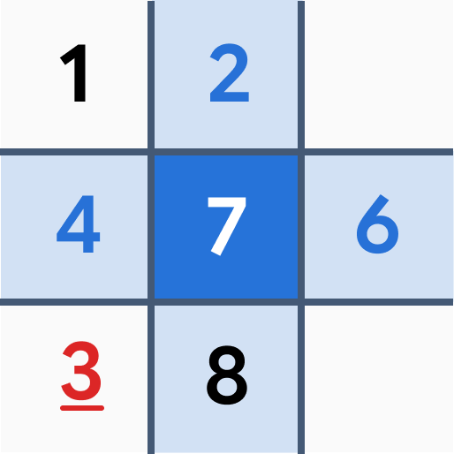

<p align="center">
  
</p>

<h1 align="center">Sudoku</h1>

<p align="center">
  A little focus. One puzzle at a time.<br />
  An open-source Sudoku app built with Flutter and Rudi UI.
</p>

<p align="center">
  <a href="pubspec.yaml"></a>
  <a href="pubspec.yaml"></a>
  <a href="LICENSE"></a>
</p>

<p align="center">
  <a href="#features">Features</a> &nbsp;·&nbsp;
  <a href="#platforms">Platforms</a> &nbsp;·&nbsp;
  <a href="#run-from-source">Run from source</a> &nbsp;·&nbsp;
  <a href="CONTRIBUTING.md">Contributing</a>
</p>

---

Pick up your daily puzzle, return to an unfinished game, or start a fresh board. Sudoku keeps the experience simple: a clear grid, useful solving tools, and progress saved on your device.

<!-- Screenshots: add real app captures here when available. Keep images in
     docs/screenshots/ and use relative paths with descriptive alt text.
     Suggested views: home, a game in progress, and board themes.
     Do not add image tags until the corresponding files exist. -->

## Features

| | |
| --- | --- |
| **A puzzle every day** | Daily challenges with a calendar to revisit earlier days and keep track of completed puzzles. |
| **Fresh boards, your pace** | Locally generated, unique-solution puzzles with verified no-guess logical paths in easy, medium and hard levels. |
| **Tools for solving** | Pencil notes, automatic note cleanup, undo, redo and erasing. Explanatory hints show the logical steps leading to the next placement. Choose a cell first or select a number first. |
| **Just enough guidance** | Solution checking marks only incorrect entries; correct digits and clues stay unmarked. Optional conflict-only checking or no checking. After nine placements, a digit becomes a disabled checkmark; erasing or undoing a placement makes it available again. |
| **Pick up where you left off** | Automatic local saves, separate daily and free-play progress, and a pause dialog that conceals the board. |
| **Make it yours** | Light, dark and system appearance, four board themes, optional haptics and an optional timer. |
| **See your progress** | Completed puzzle counts, total play time and personal bests by difficulty. |
| **Touch or keyboard** | Responsive layouts, keyboard controls, and English and German translations. |

## Platforms

The project currently includes **Android**, **Windows** and **Web** targets. It is in early development; iOS, macOS and Linux runners are not included yet.

You can run the app from source using the steps below. Platform builds, signing and Web deployment are documented in the [release guide](docs/RELEASING.md).

The `Publish GitHub Pages` workflow automatically tests, builds and deploys the Web app on pushes to `main`, and can also be started manually on `main`. Enable **Settings → Pages → Source → GitHub Actions** in the repository once. The workflow uses the configured Pages path and preserves offline support.

## Your puzzles stay with you

No account, ads, analytics or cloud game service. Puzzles are generated on your device, and your settings and progress are stored locally.

The Web version needs an initial online visit to cache the app before it can work offline. Clearing app data or browser storage removes saved games; cloud sync and backup/export are not available yet. See [data and privacy](docs/DATA.md) for details.

## Run from source

Use **Flutter 3.47.0 or newer** with **Dart 3.13.0 or newer** and the development tools for your target platform. Android needs the Android SDK and JDK; Windows needs Visual Studio with the C++ desktop workload.

From the repository root:

```sh
flutter pub get --enforce-lockfile
dart run build_runner build
flutter devices
flutter run -d <device-id>
```

For example, use `flutter run -d windows` for Windows or `flutter run -d chrome` for Web. For Android, use the ID of a connected device or emulator from `flutter devices`.

Before a Web debug run, compile the background worker (repeat after engine changes):

```sh
dart compile js -O2 lib/features/game/data/puzzle_worker.dart -o web/sudoku_worker.js
```

Native generation uses an isolate; Web generation uses a dedicated worker so searching does not block the interface. Web release preparation compiles and caches the worker automatically.

[Rudi UI](https://github.com/zTomz/rudi_ui) is fetched from the public Git revision pinned in `pubspec.yaml`. No separate Rudi checkout or local override is needed.

<details>
<summary><strong>Development checks</strong></summary>

```sh
dart format --output=none --set-exit-if-changed lib test .github/prepare_web.dart
flutter analyze
dart analyze --fatal-infos .github/prepare_web.dart
flutter test
```

When changing translations, edit both ARB files in `lib/l10n/`, run `flutter gen-l10n`, and include the generated files. Do not edit generated Dart manually.

Application state uses Riverpod with generator syntax. After editing providers, run `dart run build_runner build` and include the generated files. Repository and generator providers can be overridden in tests; no manual providers or ChangeNotifier adapters are used.

The test suite covers puzzle validity and uniqueness, reproducible daily challenges, undo/redo, persistence and UI behavior. Manual device testing complements these checks.

For Web release builds, follow the [offline-cache preparation steps](docs/RELEASING.md#web--github-pages). A regular debug run does not prepare the release cache.

</details>

## Contributing

Bug reports, UI improvements, translations and code contributions are welcome. Start with the [contributing guide](CONTRIBUTING.md), and discuss substantial changes before opening a pull request.

New free-play and daily puzzles are graded by logical solving techniques: singles for easy; locked candidates and pairs for medium; triples, X-Wing and XY-Wing additionally available for hard. Medium and hard puzzles must resist the simpler technique set. An additional effort score counts technique frequency and scarce immediate moves, allowing finer comparison within a tier; it is shown in the hint sheet. Generation prefers rotationally symmetric clues, but prioritizes the requested difficulty. Ratings are deterministic heuristics, not a universal measure of human difficulty.

Free-play and daily puzzles use the same technique-graded generator; no legacy generator or save migrations are included. Generation is bounded and may offer a retry rather than substitute an incorrectly rated puzzle. Hints use the current board, ignore player notes and ask for incorrect entries to be corrected first; they do not automatically enter numbers. Backup/export and additional Sudoku variants are not implemented yet.

## Built with

- **[Flutter & Dart](pubspec.yaml)** for the app and puzzle engine.
- **[Rudi UI](https://github.com/zTomz/rudi_ui)** for components, themes and interaction patterns.
- **[Cue](https://pub.dev/packages/cue)** for transitions.
- **[Riverpod](https://riverpod.dev/)** with code generation for application state and testable dependencies.
- **[Solar Icons](https://solar-icons.vercel.app/)** through the `solar_icons` Flutter package.
- **Google Sans** for typography, bundled with the app.

## License

Sudoku is created by **Tom Vogel** and released under the [MIT License](LICENSE).

Third-party assets keep their own licenses: [Google Sans](assets/fonts/OFL.txt) uses the SIL Open Font License; [Solar Icons and its Flutter package](assets/licenses/solar-icons.txt) include CC BY 4.0 and BSD-3-Clause notices. Rudi UI is MIT-licensed. Other dependencies retain their respective licenses.
