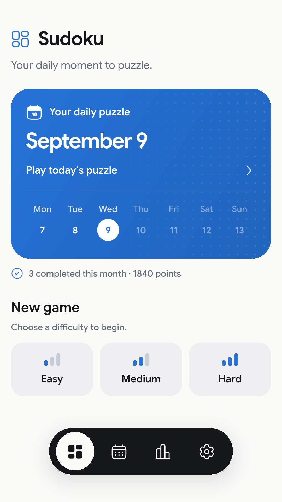
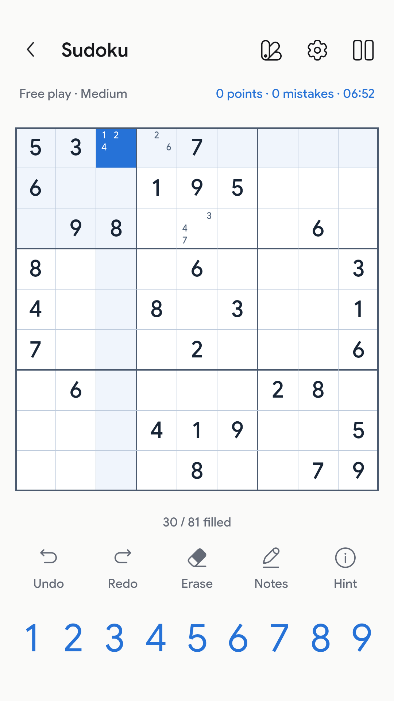
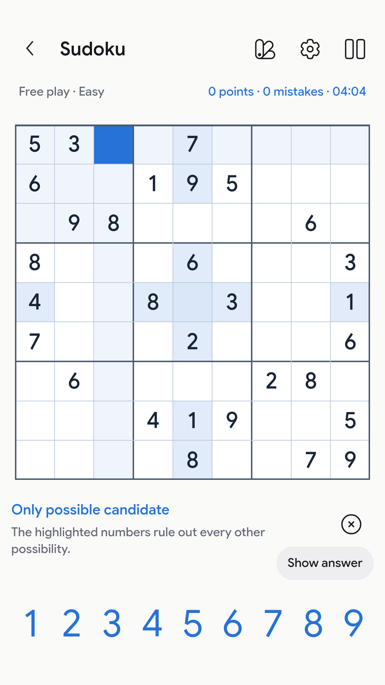
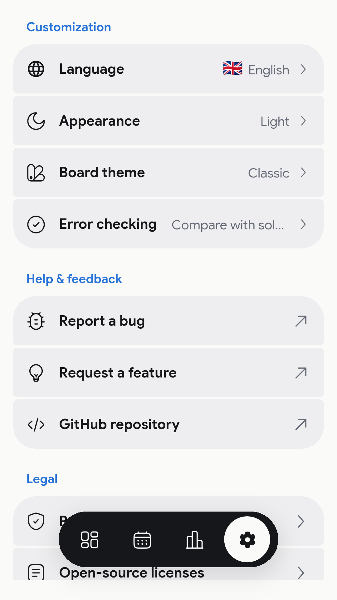

<p align="center">
  
</p>

<h1 align="center">Sudoku</h1>

<p align="center">
  A calm, straightforward Sudoku app for the daily puzzle and everything in between.<br />
  Open source, built with Flutter, and free of accounts, ads and tracking.
</p>

<p align="center">
  <a href="pubspec.yaml"></a>
  <a href="pubspec.yaml"></a>
  <a href="LICENSE"></a>
</p>

<p align="center">
  <a href="https://ztomz.github.io/Sudoku/">Play online</a> &nbsp;·&nbsp;
  <a href="#screenshots">Screenshots</a> &nbsp;·&nbsp;
  <a href="#features">Features</a> &nbsp;·&nbsp;
  <a href="#run-from-source">Run from source</a> &nbsp;·&nbsp;
  <a href="CONTRIBUTING.md">Contributing</a>
</p>

---

I built Sudoku because I wanted a puzzle app that feels polished without constantly asking for attention. Open it, solve a board, and put it away again. Your games stay on your device, and the app works without an account or a network connection.

There is a fresh daily puzzle, locally generated free-play boards, and a small set of tools that help without solving the game for you.

## Screenshots

<p align="center">
  
  
  
  
</p>

## Get Sudoku

- **Web:** [Play in your browser](https://ztomz.github.io/Sudoku/). Once it has loaded successfully, it is available offline too.
- **Android (Google Play closed test):** [Join the tester group](https://groups.google.com/g/app-sudoku-testers), then [opt in on Google Play](https://play.google.com/apps/testing/com.tomvogel.sudoku). Access is limited to approved group members.
- **Android (APK):** Download `app-release.apk` from the [latest release](https://github.com/zTomz/Sudoku/releases/latest).
- **Windows:** Build the desktop app from source using the instructions below.

## Features

- A daily puzzle with a calendar for going back to earlier days
- Fresh easy, medium and hard boards generated on your device
- Pencil notes, undo and redo, number-first input, and keyboard controls
- Step-by-step hints that explain the next logical move before offering the answer
- Optional error checking, haptics and timer
- Light and dark mode, four board themes, and English and German translations
- Local progress, statistics, best times and scores
- Responsive layouts for phones, tablets, Web and Windows

The generator grades puzzles by the techniques needed to solve them, not just by clue count. Every generated board has a unique solution and a logical path that does not require guessing.

## Private by default

Sudoku has no account, ads, analytics or cloud game service. Puzzles are generated locally, and your games, statistics and settings stay on your device.

The Web version needs one successful online visit before it can work offline. New releases activate automatically and may reload the page once after their offline files are ready. Saves are kept locally with a previous validated recovery snapshot, but clearing app data or browser storage removes both; cloud sync and backup/export are not available. See the [Privacy Policy](https://ztomz.github.io/Sudoku/#/privacy-policy) or the [technical data inventory](docs/DATA.md) for the details.

## Platforms

The repository contains **Android**, **Windows** and **Web** targets. The Web version is hosted on [GitHub Pages](https://ztomz.github.io/Sudoku/), and Android builds are published with [GitHub Releases](https://github.com/zTomz/Sudoku/releases). Windows can currently be built from source. iOS, macOS and Linux runners are not included.

Builds, signing and the Web deployment are documented in the [release guide](docs/RELEASING.md).

## Run from source

You need **Flutter 3.47.0 or newer** with **Dart 3.13.0 or newer**, plus the development tools for your target platform. Android requires the Android SDK and a JDK; Windows requires Visual Studio with the C++ desktop workload.

```sh
flutter pub get --enforce-lockfile
dart run build_runner build
flutter devices
flutter run -d <device-id>
```

For example, use `flutter run -d windows` for Windows or `flutter run -d chrome` for Web. For Android, choose a connected device or emulator from `flutter devices`.

Before a Web debug run, compile the background worker. Repeat this after changing the puzzle engine:

```sh
dart compile js -O2 lib/features/game/data/puzzle_worker.dart -o web/sudoku_worker.js
```

Puzzle generation runs in an isolate on native platforms and in a dedicated worker on Web, so it does not block the interface. Release preparation compiles and caches the Web worker automatically.

[Rudi UI](https://github.com/zTomz/rudi_ui) is fetched from the public Git revision pinned in `pubspec.yaml`; a separate local checkout is not required.

<details>
<summary><strong>Development checks</strong></summary>

```sh
dart format --output=none --set-exit-if-changed lib test .github/prepare_web.dart
flutter analyze
dart analyze --fatal-infos .github/prepare_web.dart
flutter test
```

When changing translations, edit both ARB files in `lib/l10n/`, run `flutter gen-l10n`, and include the generated files. Do not edit generated Dart manually.

Application state uses Riverpod with code generation. After editing providers, run `dart run build_runner build` and include the generated files.

For Web release builds, follow the [offline-cache preparation steps](docs/RELEASING.md#web--github-pages).

</details>

## Contributing

Bug reports, UI ideas, translations and pull requests are welcome. The [contributing guide](CONTRIBUTING.md) covers the basics. If you are planning a larger change, please open an issue first so we can make sure it fits the project.

The puzzle generator, solver and grading system are all part of this repository. Easy boards use singles; medium boards can add locked candidates and pairs; hard boards can also use triples, X-Wing and XY-Wing. Generation prefers rotationally symmetric clues but always prioritizes the requested difficulty.

## Built with

- [Flutter & Dart](pubspec.yaml) for the app and puzzle engine
- [Rudi UI](https://github.com/zTomz/rudi_ui) for components and themes
- [Riverpod](https://riverpod.dev/) for application state
- [Cue](https://pub.dev/packages/cue) and [Reel Text](https://pub.dev/packages/reel_text) for motion
- [go_router](https://pub.dev/packages/go_router) for navigation and Web deep links
- [Solar Icons](https://solar-icons.vercel.app/) and Google Sans for the visual language

## License

Sudoku is made by [Tom Vogel](https://github.com/zTomz) and released under the [MIT License](LICENSE).

Third-party assets keep their own licenses. Google Sans uses the [SIL Open Font License](assets/fonts/OFL.txt); Solar Icons and its Flutter package include [CC BY 4.0 and BSD-3-Clause notices](assets/licenses/solar-icons.txt). Rudi UI is MIT-licensed.
